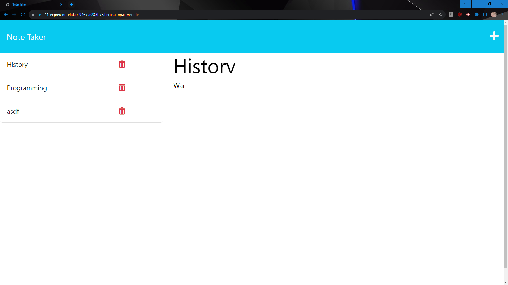

# Express.js-Note-Taker

Module 11 Challenge submission by Connor Ness

Used the module 11 mini project as the backend skeleton, and refactored to meet challenge criteria. Should have bonus delete request functionality.

[Github Repo](https://github.com/PengasKhan/Express.js-Note-Taker)

[Heroku Deployment](https://cnm11-expressnotetaker-94679e233b78.herokuapp.com/)

